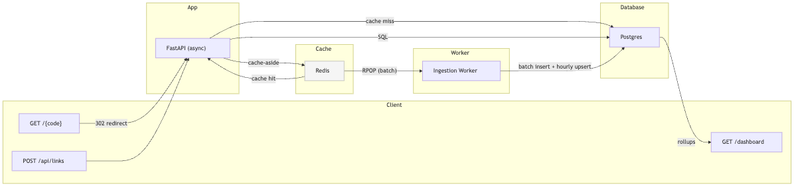

# 🔗 LinkForge

A high-throughput **URL shortener with real-time analytics**, built as a pure-Python
full-stack application: **FastAPI + Postgres + Redis + HTMX**.

### ▶️ Live demo: **https://linkforge-9gwq.onrender.com**

> Deployed on Render (free tier — the first request after it's been idle takes
> ~30–50s to wake, then it's fast).

LinkForge is the classic "design a URL shortener" system-design problem turned into a
real, running, load-tested product — with the engineering that makes it scale:
cache-aside redirects, a distributed token-bucket rate limiter, and asynchronous,
batched analytics ingestion.

> No JavaScript framework. The UI is server-rendered HTML with **HTMX** for live
> updates, plus a light/dark theme toggle.

---

## Why it's interesting (the engineering)

| Concern | How LinkForge handles it |
|---|---|
| **Fast redirects** | Cache-aside in Redis. A hot link never touches Postgres; misses warm the cache with a TTL. Cache hit/miss is tracked and shown live. |
| **Abuse / fairness** | A **distributed token-bucket rate limiter** implemented as an atomic Redis **Lua** script. Uses the Redis server clock (`TIME`), so it's correct across many app instances regardless of host clock skew. |
| **Analytics without slowing redirects** | The redirect path only does an O(1) `LPUSH` of a click event. A background **ingestion worker** drains the queue in batches and writes raw events, **pre-aggregated hourly rollups** (upsert), and a denormalised counter. |
| **Dashboard stays fast at scale** | Reads hit the `click_stats_hourly` rollup table, not the raw event firehose. |
| **Compact short codes** | Base62 encoding of the auto-increment id — collision-free by construction. Custom aliases supported. |
| **Async end-to-end** | `asyncpg` + SQLAlchemy 2.0 async + `redis.asyncio`. The hot path bypasses the ORM and uses prepared SQL. |

## Architecture



## Quickstart (Docker)

```bash
docker compose up --build
# app:        http://localhost:8000
# dashboard:  http://localhost:8000/dashboard
```

Postgres and Redis stay on the internal compose network (not published to the
host), so the stack never clashes with a local Postgres/Redis. Seed demo data so
the dashboard has something to show — run it inside the app container:

```bash
docker compose exec app python scripts/seed.py
```

### Run locally without Docker

```bash
# start Postgres + Redis however you like, then:
cp .env.example .env
pip install -r requirements.txt
uvicorn app.main:app --reload
```

## API

```bash
# create a short link
curl -X POST localhost:8000/api/links \
  -H 'content-type: application/json' \
  -d '{"long_url": "https://fastapi.tiangolo.com/"}'
# → {"short_code":"q0u","short_url":"http://localhost:8000/q0u", ...}

# follow it
curl -i localhost:8000/q0u            # 302 → destination

# stats for one link
curl localhost:8000/api/links/q0u
```

Exceed the bucket (default 20 burst, 5 req/s refill) and the API returns `429` with `Retry-After`.

## Load testing

```bash
locust -f locustfile.py --host http://localhost:8000 \
  --users 200 --spawn-rate 50 --run-time 60s --headless
```

A second, multi-endpoint scenario (`stress_test.py`) drives a realistic mix —
redirect / live alias-check / create / dashboard — at 150–600 concurrent users.

**Results** — single Uvicorn worker (same shape as the Render deployment), with
Postgres, Redis *and* the load generator all on one laptop, so CPU was the bottleneck:

```
Scenario            Users   Total reqs   Throughput   Failures   Redirect p50/p95/p99
----------------------------------------------------------------------------------------
Steady state         150       53,944     1,204/s      0.00%        39 / 71 / 98 ms
High load            400       52,757     1,179/s      0.00%        41 / 93 / 140 ms
Spike (ramp 300/s)   600       40,679     1,363/s      0.00%        38 / 120 / 640 ms

~147k requests, 0 failures · 99.5% cache hit rate · ingestion queue drained to 0
```

- **Zero failures** across every scenario; redirects stay <150 ms p95 even at 4× the
  saturation point, and latency recovers to ~3–8 ms instantly after a spike.
- The single worker is **CPU-bound on one core** (~1,200 req/s ceiling). The app is
  stateless, so it scales ~linearly — **4 workers on the same box reached ~2,200 req/s**.
- The distributed token-bucket limiter throttles correctly (20 burst → 429 → refill).

📄 **Full breakdown — per-endpoint latency, resource usage, and recommendations — in
[`report.md`](report.md).**

## Tests

```bash
pytest -q
```

## Deploy

The repo ships a Render **Blueprint** (`render.yaml`) that provisions the whole
stack — web service (Docker), managed Postgres, and a Key Value (Redis) instance —
and wires them together:

1. In the [Render dashboard](https://dashboard.render.com): **New + → Blueprint**,
   connect this repo, **Apply**.
2. The app reads `DATABASE_URL` / `REDIS_URL` from the managed services, listens on
   the injected `$PORT`, and builds shareable short links from `RENDER_EXTERNAL_URL`
   automatically — no manual config.
3. `autoDeploy` is on, so every push to `main` ships a new version.

Seed demo data from the live service's **Shell** tab: `python scripts/seed.py`.

## Tech stack

FastAPI · SQLAlchemy 2.0 (async) · asyncpg · Redis (cache, Lua rate limiter, queue) ·
Jinja2 · HTMX · Docker Compose · Locust.

## Project layout

```
app/
  main.py            # app wiring + lifespan (worker, table create)
  config.py          # pydantic-settings
  database.py        # async engine/session
  models.py          # Link, ClickEvent, ClickStatHourly
  base62.py          # short-code encoding
  redis_client.py
  ratelimit.py       # token-bucket dependency
  lua/token_bucket.lua
  analytics.py       # ingestion worker + rollup queries
  routers/
    redirect.py      # GET /{code}  (hot path)
    links.py         # /api JSON
    web.py           # pages + HTMX partials
    helpers.py       # shared create-link logic
  templates/ static/
scripts/seed.py
locustfile.py
tests/
```
